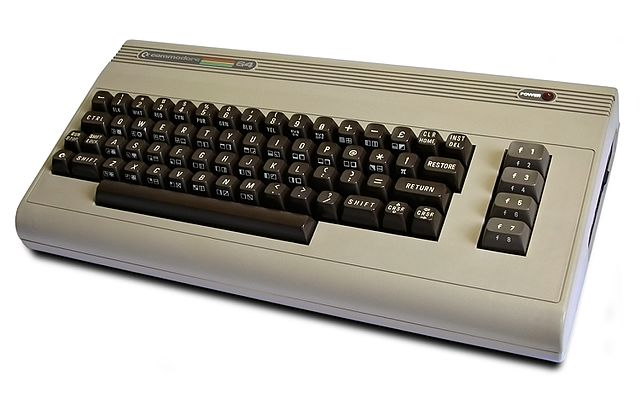

[Photo by Bill Bertram](https://commons.wikimedia.org/w/index.php?curid=180885)

# C64 Playground

## Motivation

Many kids in the eighties grew up with a Commodore 64 home computer. I
was one of them. I mostly used it to play games and occasionally try
my hand at some very humble Basic programming.

One glorious day my C64 stopped working. It was eventually replaced by
a 386 compatible.

These days the net is full of love for retro computing. The 64 is
definitely no exception.

You might ask why would anyone today concern himself with 40 years old
technology. Well, because it's *fun*, you grumpy old twat!
It also lets you approach computer science at its most basic level of
bits and bytes with an architecture that is far more easily understood
than today's Intel/AMD/NVidia/VIA/Arm64e complexity monsters.

The availability of free/open source software emulators makes the
exploration experience extremely excellently exciting and exceptional.

## What this is

This is my notebook of C64 studies. As I learn new things, I forget
them at amazing rates, so I put them here for my personal reference.

## Dedication

My dad bought the C64 in a computer shop which was just across the
road in my small town. It was cleverly called *Abaco* as a nod to the
first computers in human history.

As a curious little kid, I used to spend hours there, looking at all
the amazing things that computers could do. Gianfranco, the shop
owner, was the friendliest guy I knew. He tolerated my presence and
never ending curiosity.

One day I asked him how to make games for my C64. He started talking
about sprites, machine code and other stuff that was Greek to me at
the time. Well, it still is, mostly.

Gianfranco was also an Internet pioneer. He used to run
a [local e-zine](http://www.ciociari.com/) full of contributions of
all kinds from his loving friends. It still is very popular in town.

Gianfranco also believed in the ideal of a universally connected humanity as
was evident in his love of the [esperanto
language](https://eo.wikipedia.org/wiki/Gianfranco_Molle).

As I try and learn things about the computer I grew up with as a kid,
I cannot stop thinking of the carefree days I spent at Gianfranco's
shop.

